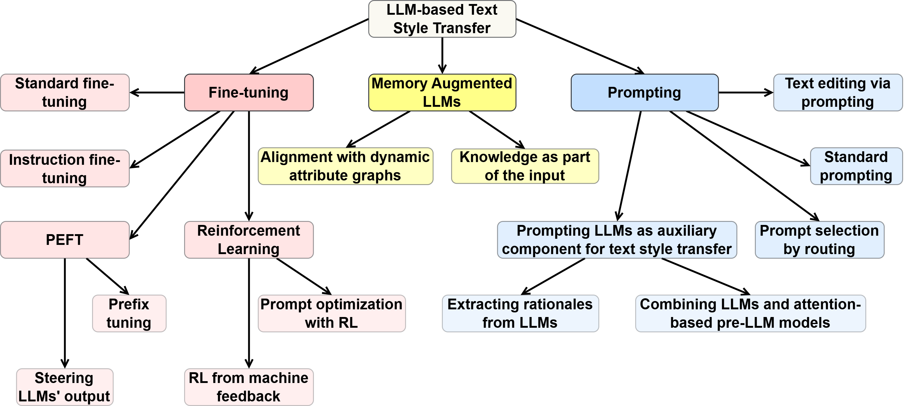
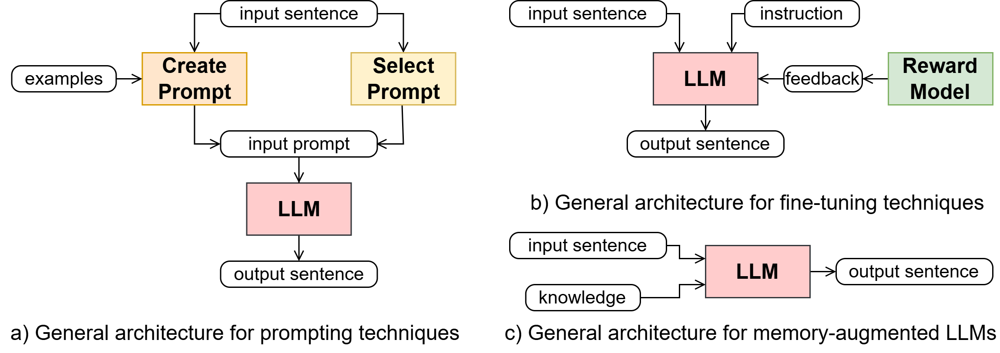

# LLM-Based Text Style Transfer: Have We Taken a Step Forward?

This is the official repository for the paper [LLM-Based Text Style Transfer: Have We Taken 
a Step Forward?](https://ieeexplore.ieee.org/abstract/document/10915631).

Text style transfer is the task of altering the stylistic way in which a given sentence is written 
while maintaining its original meaning. The task requires models to identify and modify various 
stylistic properties, such as politeness, formality, and sentiment. With the advent of Large 
Language Models (LLMs) and their remarkable performances for a variety of tasks, numerous LLMs have 
emerged in the past few years. This paper provides an overview of recent advancements in text style 
transfer using LLMs. The discussion is focused on LLM-based approaches commonly used for text 
generation and their adoption for text style transfer. The paper is organized around three main 
groups of methods: prompting techniques for LLMs, fine-tuning techniques for LLMs, and 
memory-augmented LLMs. The discussion emphasizes the similarities and differences among the 
discussed methods and groups, along with the challenges and opportunities that are expected to 
direct and foster further research in the field.

Read the full paper [here](https://ieeexplore.ieee.org/stamp/stamp.jsp?arnumber=10915631). If you 
find this review useful, please kindly cite our paper:

```
@article{toshevska2025llm,
  title={LLM-Based Text Style Transfer: Have We Taken a Step Forward?},
  author={Toshevska, Martina and Gievska, Sonja},
  journal={IEEE Access},
  year={2025},
  publisher={IEEE}
}
```

We present the approaches for LLM-based text style transfer laid out through the lenses of three 
main categories: *prompting techniques for LLMs*, *fine-tuning techniques for LLMs*, and 
*memory-augmented LLMs*. 

The categorization of the LLM-based text style transfer methods in groups and subgroups is 
displayed in the following figure:


A general architecture of the methods in the three main categories is shown in the following figure:


- `Prompting techniques for LLMs` are one of the earliest explored methods that include standard 
  zero-shot and few-shot prompting, selecting optimal prompt via routing, text editing via 
  prompting, as well as using LLMs as auxiliary components to enhance traditional pre-LLM approaches.

  - `Standard zero-shot and few-shot prompting`
  
    - E. Reif, D. Ippolito, A. Yuan, A. Coenen, C. Callison-Burch, and J. Wei, *A recipe for 
      arbitrary text style transfer with large language models*, in Proc. 60th Annu. Meeting 
      Assoc. Comput. Linguistics, 2022, pp. 837–848.
    
    - M. Suzgun, L. Melas-Kyriazi, and D. Jurafsky, *Prompt-and-rerank: A method for zero-shot 
      and few-shot arbitrary textual style transfer with small language models*, in Proc. Conf. 
      Empirical Methods Natural Lang. Process., 2022, pp. 2195–2222.
    
    - S. Mukherjee, A. K. Ojha, and O. Dušek, *Are large language models actually good at text 
      style transfer?* 2024.
    
  - `Text editing via prompting`
  
    - P. Liu, L. Wu, L. Wang, S. Guo, and Y. Liu, *Step-by-step: Controlling arbitrary style in 
      text with large language models*, in Proc. Joint Int. Conf. Comput. Linguistics, Lang. 
      Resour. Eval. (LREC-COLING), 2024, pp. 15285–15295.
    
    - G. Luo, Y. Han, L. Mou, and M. Firdaus, *Prompt-based editing for text style transfer*, in 
      Proc. Findings Assoc. Comput. Linguistics, EMNLP, 2023, pp. 5740–5750.
    
  - `Prompt selection by routing`
  
    - Q. Liu, J. Qin, W. Ye, H. Mou, Y. He, and K. Wang, *Adaptive prompt routing for arbitrary 
      text style transfer with pre-trained language models*, in Proc. AAAI Conf. Artif. Intell., 
      Mar. 2024, vol. 38, no. 17, pp. 18689–18697.
    
  - `Prompting LLMs as auxiliary component for text style transfer`
  
    - C. Zhang, H. Cai, Y. Li, Y. Wu, L. Hou, and M. Abdul-Mageed, *Distilling text style 
      transfer with self-explanation from LLMs*, in Proc. Conf. North Amer. Chapter Assoc. 
      Comput. Linguistics, Hum. Lang. Technol., 2024, pp. 200–211.
    
    - L. Pan, Y. Lan, Y. Li, and W. Qian, *Unsupervised text style transfer via LLMs and 
      attention masking with multi-way interactions*, 2024.
    
- `Fine-tuning techniques for LLMs` involve adapting to specific tasks through standard 
  fine-tuning, instruction fine-tuning, parameter-efficient fine-tuning, and reinforcement learning.

  - `Standard Fine-tuning and Instruction Fine-tuning`
  
    - S. Mukherjee and O. Dusek, *Leveraging low-resource parallel data for text style transfer*,
      in Proc. 16th Int. Natural Lang. Gener. Conf., 2023, pp. 388–395.
    
    - S. Mukherjee, A. K. Ojha, and O. Dušek, *Are large language models actually good at text 
      style transfer?*, 2024. 
    
    - A. Zarcone and F. Kopf, *Bubble up—A fine-tuning approach for style transfer to 
      community-specific subreddit language*, in Proc. 3rd Workshop Comput. Linguistics 
      Political Social Sci., 2023, pp. 46–58.
    
    - M. La Quatra, G. Gallipoli, and L. Cagliero, *Self-supervised text style transfer using 
      cycle-consistent adversarial networks*, ACM Trans. Intell. Syst. Technol., vol. 15, no. 5, 
      pp. 1–38, Oct. 2024. 
    
    - A. Bhandarkar, R. Wilson, A. Swarup, and D. Woodard, *Emulating author style: A 
      feasibility study of prompt-enabled text stylization with off-the-shelf LLMs*, in Proc. 
      1st Workshop Personalization Generative AI Syst., 2024, pp. 76–82.
    
  - `Parameter Efficient Fine-tuning (PEFT)`
  
    - H. Mai, W. Jiang, and Z.-H. Deng, *Prefix-tuning based unsupervised text style transfer*, 
      in Proc. Findings Assoc. Comput. Linguistics, EMNLP, 2023, pp. 14847–14856.
    
    - K. Konen, S. Jentzsch, D. Diallo, P. Schütt, O. Bensch, R. E. Baff, D. Opitz, and T. 
      Hecking, *Style vectors for steering generative large language models*, in Proc. Findings 
      Assoc. Comput. Linguistics, EACL, 2024, pp. 782–802. 
    
    - W. Lai, V. Hangya, and A. Fraser, *Style-specific neurons for steering LLMs in text style 
      transfer*, 2024.
    
  - `Approaches Based on Reinforcement Learning`
  
    - P. Liu, L. Wu, L. Wang, S. Guo, and Y. Liu, *Step-by-step: Controlling arbitrary style in 
      text with large language models*, in Proc. Joint Int. Conf. Comput. Linguistics, Lang. 
      Resour. Eval. (LREC-COLING), 2024, pp. 15285–15295.
    
    - M. Deng, J. Wang, C.-P. Hsieh, Y. Wang, H. Guo, T. Shu, M. Song, E. Xing, and Z. Hu, 
      *RLPrompt: Optimizing discrete text prompts with reinforcement learning*, in Proc. Conf. 
      Empirical Methods Natural Lang. Process., 2022, pp. 3369–3391.
    
    - T. Ziegenbein, G. Skitalinskaya, A. Bayat Makou, and H. Wachsmuth, *LLM-based rewriting 
      of inappropriate argumentation using reinforcement learning from machine feedback*, in 
      Proc. 62nd Annu. Meeting Assoc. Comput. Linguistics, Bangkok, Thailand, 2024, pp. 4455–4476.
    
- `Memory-augmented LLMs` although relatively unexplored, focus on integrating external 
  knowledge as part of the input prompts and aligning models with dynamic attribute graphs.

  - C. Zong, Y. Chen, W. Lu, J. Shao, and Y. Zhuang, *ProSwitch: Knowledge-guided instruction 
    tuning to switch between professional and non-professional responses*, 2024.
  
  - M. Toshevska and S. Gievska, *Large language models for text style transfer: Exploratory 
    analysis of prompting and knowledge augmentation techniques*, in Intell. Environments, 
    Combined Proc. Workshops Demos Videos Session, Jun. 2024, pp. 134–142. 
  
  - M. Toshevska, S. Kalajdziski, and S. Gievska, *Style knowledge graph: Augmenting text style 
    transfer with knowledge graphs*, in Proc. Int. Workshop Generative AI Knowl. Graphs@ 
    GenAIK-COLING, 2025, pp. 123–135.
  
  - X. Liang, H. Wang, S. Song, M. Hu, X. Wang, Z. Li, F. Xiong, and B. Tang, *Controlled text 
    generation for large language model with dynamic attribute graphs*, 2024.
